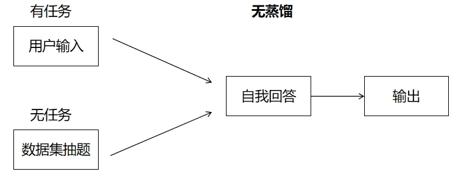
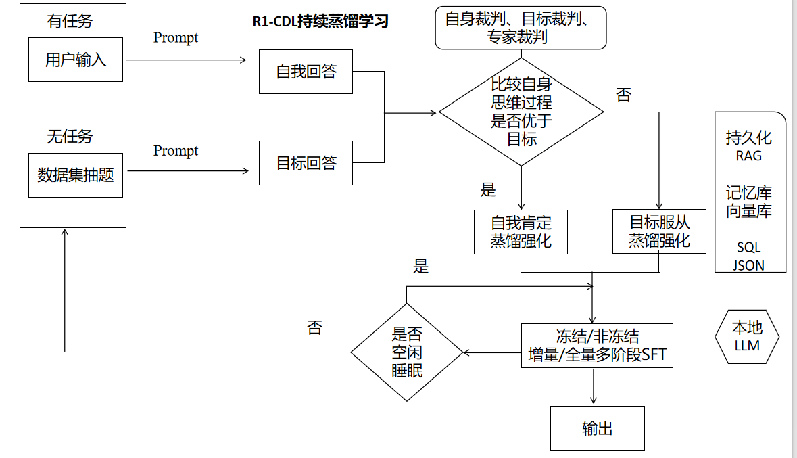
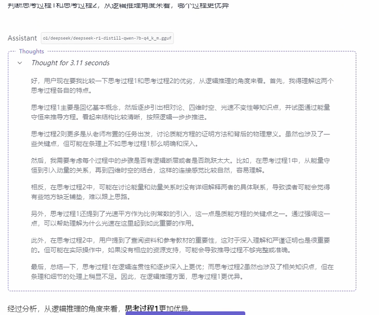

# R1-CDL
Continuous Distillation Learning持续蒸馏学习，在类DeepSeek-R1知识蒸馏强化的基础上，意图小模型能够以极低成本且简易的方式复制繁殖目标模型的强壮思维，在获取高价值蒸馏数据的同时，让小模型继承目标模型的强推理能力。以此期待，成为AGI与硅基生命演化的一种新实现范式。

无蒸馏

R1-CDL持续蒸馏学习

要点说明：

#1. 无任务时，抽取的数据集，经常是一道题或几道题，这种数据集可以是慢思考、长CoT、知识蒸馏强化等Resoning推理数据集，如 https://huggingface.co/datasets/bespokelabs/Bespoke-Stratos-17k

#2. 判断自身思考过程与目标思考过程是关键一步，一般而言，目标推理能力更强，核心就在于比较标签think或thinker的思考推理内容，自身裁判就是自我反思，目标裁判就是目标模型（对手模型）来评判，专家裁判则可以是水平更高的，如DeepSeek R1 67B或OpenAI O1 来判断

#3. 强化分为了自我肯定强化和服从他人强化，有着心理学与认知理论的深刻依据

#4. 无论是经过自我强化，还是服从强化，均视为进行知识强化蒸馏，而一般可以采取，以类似RAG问答对的办法，存入SQL，当需要在线持续SFT微调，由SQL转为JSON，但数据的核心资产已从输出的结果答案，转变为思考推理的过程

#5. 冻结LLM指的是，冻结大部分的本地LLM神经元层参数，而只选用极少的神经元层进行微调，在未来，还可以为这些神经元层放置探针，并像FMRI一样扫描脑区活动，而特定区域的神经元层，承担更分化的特定功能。回到LLM微调本身，这样做是由于，在线持续学习，每次所使用的微调数据量非常少，这样也能提升效率，以近乎无尽的时间换取无限的效果，最终作为实现AGI的一条独特的，类似生物演化路径
